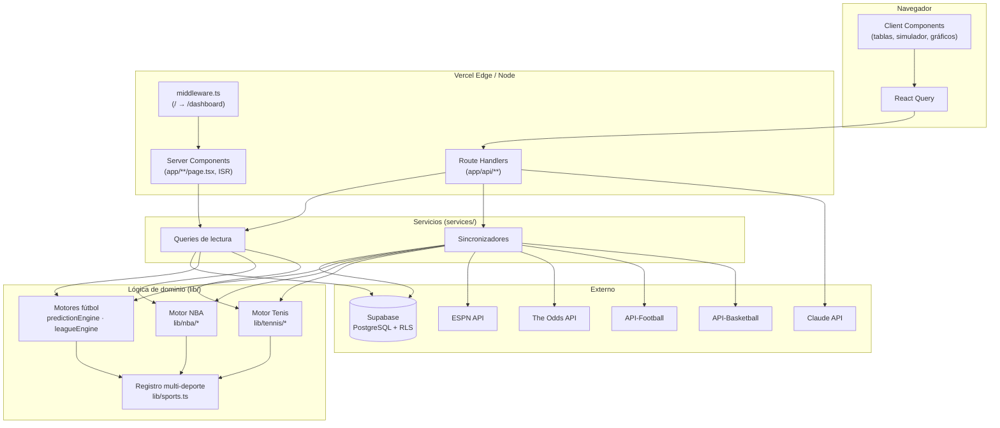
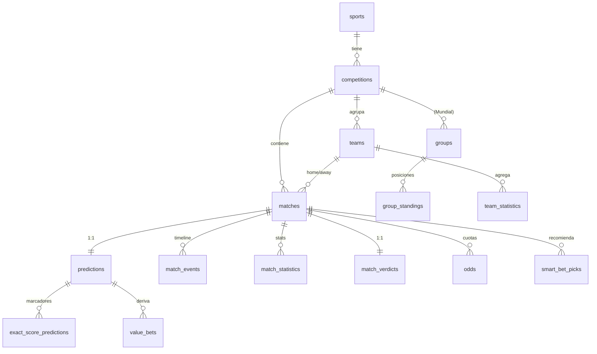
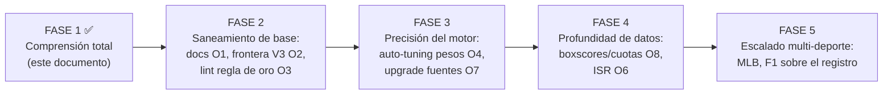

# FASE 1 · Análisis de Arquitectura — INDU Predictor

> **Rol:** Chief Software Architect / CTO / Lead Engineer
> **Fase:** 1 — Comprensión total del proyecto (sin modificar código)
> **Fecha del análisis:** 2026-07-19
> **Repositorio:** `sepulvedayeison98-sys/world-cup-predictor-2026`
> **Rama de trabajo:** `claude/indu-predictor-architecture-analysis-5qxz6y`

Este documento es el entregable de la Fase 1. **No se ha modificado, movido ni
eliminado ningún archivo de código.** Es un análisis de solo lectura del estado
actual, verificado archivo por archivo contra el repositorio, no contra la
documentación previa (que en varios puntos está desactualizada — ver §11).

---

## Nota preliminar sobre el nombre del proyecto

El brief de esta fase se refiere al proyecto como **"INDU Predictor"**. El código
real, sin embargo, se identifica en todos sus documentos y en la UI como
**"Veredicto · Inteligencia Deportiva"** (repo histórico `world-cup-predictor-2026`).
No asumo que sean nombres distintos ni que uno reemplace al otro: registro la
discrepancia como un **hecho a resolver a nivel de producto/marca** antes de la
Fase 2. En el resto del documento uso "la plataforma" para evitar ambigüedad.

---

# 1 · Resumen ejecutivo

La plataforma es una **aplicación web pública multi-deporte de predicción y
análisis deportivo** construida sobre Next.js 15 (App Router) + TypeScript +
Supabase. Cubre tres deportes con dominios **arquitectónicamente aislados**:
fútbol (Mundial 2026 + 5 grandes ligas europeas), baloncesto (NBA) y tenis (ATP).
Es de acceso libre, sin autenticación.

**Veredicto de madurez: producción funcional, con arquitectura sólida y deuda
técnica acotada.** El proyecto está notablemente bien diseñado para su etapa:
tiene una regla de aislamiento entre deportes **impuesta por linter** (no solo por
convención), motores de predicción puros y testeados (166 pruebas unitarias),
honestidad estadística como principio de producto (cero datos fabricados,
líneas base publicadas), y una capa de sincronización de datos resiliente vía
crons. La estética y el discurso de producto ("terminal financiera",
transparencia de calibración) son coherentes.

Las debilidades son de **evolución**, no de fundación: documentación
desincronizada del código, una capa "V3" (agents/models/intelligence) que
coexiste con el motor autoritativo sin una frontera clara, tablas vestigiales de
un modelo con autenticación que ya no existe, y dependencia de fuentes de datos
gratuitas que limitan la profundidad del producto (sin boxscores NBA, sin cuotas
en vivo para mercados secundarios).

| Dimensión | Estado | Nota |
|-----------|--------|------|
| Arquitectura base | 🟢 Sólida | Aislamiento multi-deporte real, motores puros |
| Calidad de datos | 🟢 Honesta | Data First aplicado con rigor |
| Cobertura de tests | 🟢 Alta | 166 `test()` en 24 archivos; motores cubiertos |
| Seguridad | 🟢 Razonable | RLS, CRON_SECRET timing-safe, headers, sin secretos en repo |
| Documentación | 🟡 Desactualizada | Refiere migraciones 050 / 72 tests; real: 054 / 166 |
| Deuda técnica | 🟡 Acotada | Capa V3 difusa, tablas auth vestigiales, ISR mixto |
| Dependencia de fuentes | 🟡 Limitante | Planes gratuitos condicionan features |

**Nivel de madurez global: PRODUCCIÓN TEMPRANA / BETA MADURA.**

---

# 2 · Arquitectura actual

## 2.1 Stack tecnológico (verificado en `package.json`)

| Capa | Tecnología | Versión |
|------|-----------|---------|
| Framework | Next.js (App Router) | ^15.5.19 |
| Runtime UI | React / React DOM | ^19.0.0 |
| Lenguaje | TypeScript | ^5 |
| Estilos | Tailwind CSS | ^3.4.0 |
| Estado servidor (cliente) | TanStack React Query | ^5.62.0 |
| Tablas | TanStack React Table | ^8.20.0 |
| Gráficos | Recharts | ^2.13.0 |
| Backend / BD | Supabase (`@supabase/ssr`, `supabase-js`) | ^0.12 / ^2.110 |
| IA | Anthropic SDK (`claude-sonnet-4-6`) | ^0.106.0 |
| Utilidades UI | lucide-react, clsx, tailwind-merge, date-fns, next-themes | — |
| Testing | tsx (unit), Playwright (e2e) | ^4.22 / ^1.61 |
| Deploy | Vercel + GitHub Actions | — |

## 2.2 Modelo de capas



## 2.3 Principios arquitectónicos (los pilares reales del diseño)

1. **Registro único multi-deporte (`lib/sports.ts`).** La navegación raíz nunca
   crece: crece el registro. `SPORTS` y `COMPETITIONS_NAV` son la fuente de
   verdad; helpers `sportOfCompetition(id)` y `competitionIdsOfSport(sport)`
   actúan como **lista blanca** para procesos transversales.

2. **Aislamiento de dominios impuesto por ESLint (`.eslintrc.json`).** No es una
   convención: es una regla `no-restricted-imports` que **falla el build**. Las
   barreras verificadas:

   | Dominio | Prohibido importar de |
   |---------|------------------------|
   | NBA (`lib/nba`, `components/nba`, `app/nba`, `services/*nba*`) | motores/componentes de fútbol **y** de tenis |
   | Tenis (`lib/tennis`, `components/tennis`, `app/tennis`, `services/tennis`) | motores/componentes de fútbol **y** de NBA |
   | Fútbol (motores + componentes listados) | módulos de tenis |

   **Observación:** existe barrera fútbol↛tenis pero **no** una barrera explícita
   fútbol↛NBA. Es intencional y está documentado en el propio archivo: el
   "detalle universal de partido" compone vistas NBA por diseño. Es una asimetría
   consciente, no un descuido, pero conviene tenerla presente (§10).

3. **Regla de oro multi-competición.** Toda query a `matches`, `teams`,
   `team_statistics` o `predictions` **debe** filtrar por competición (directo o
   con `matches!inner`). Conviven Mundial, amistosos, ligas y NBA en las mismas
   tablas físicas. Es el guardrail más crítico y también el más frágil (§10).

4. **Motores puros.** `predictionEngine.ts`, `lib/nba/engine.ts`,
   `lib/tennis/engine*.ts` no tocan Supabase: reciben datos, devuelven
   predicciones. Esto los hace testeables sin BD (de ahí las 166 pruebas).

5. **Data First.** Cero datos fabricados. Si la fuente no da una métrica, se
   declara honestamente y va al backlog (posesión NBA, boxscores, cuotas de
   mercados secundarios).

## 2.4 Frontend

- **Server Components** para el fetch inicial de cada página (ISR donde no hay
  cookies), **Client Components** (`'use client'`) para interactividad.
- `middleware.ts` es minimalista: solo redirige `/` → `/dashboard`. No hay
  autenticación.
- Layout raíz con `ThemeProvider` (tema oscuro fijo tipo Bloomberg/TradingView,
  acento esmeralda `#10b981`), `QueryProvider`, `Sidebar` + `Topbar` + `BottomNav`
  (navegación móvil), búsqueda global.
- 33 páginas, 76 componentes.

**Hooks y contextos (verificado):** **no existe** un directorio `hooks/` ni hooks
personalizados (`useXxx`) propios. El único React Context del proyecto es
`components/layout/MobileNavContext.tsx` (estado de la navegación móvil). El estado
de servidor se maneja con React Query; el estado de UI, con `useState` local en los
Client Components. Es una arquitectura de estado deliberadamente plana — no hay
store global (Redux/Zustand) ni una capa de hooks compartidos.

## 2.5 Backend

- No hay backend dedicado: la lógica servidor vive en **Route Handlers**
  (`app/api/**`, 25 rutas) y en **Server Components**.
- Dos clientes Supabase server-side: `lib/supabase/server.ts` (con cookies),
  `lib/supabase/static.ts` (sin cookies, para ISR), `lib/supabase/admin.ts`
  (service-role, solo servidor). Cliente browser en `lib/supabase/client.ts`.

## 2.6 Autenticación y autorización

- **No hay autenticación de usuario.** Acceso 100 % público.
- Autorización = dos planos:
  - **Lectura pública** vía RLS: el rol `anon` puede `SELECT` en las tablas de
    negocio.
  - **Escritura** exclusiva del `service-role` (bypassa RLS), usado solo desde
    servidor en los sincronizadores.
  - **Rutas de sync** protegidas por `CRON_SECRET` con comparación en tiempo
    constante (`lib/cronAuth.ts`, `timingSafeEqual`).

---

# 3 · Mapa completo del proyecto

```
world-cup-predictor-2026/
├── app/                      # Next.js App Router (33 páginas, 25 rutas API)
│   ├── dashboard/            # Inicio global (ISR)
│   ├── mundial/              # Hub Mundial + rankings + balance
│   ├── ligas/[slug]/         # 5 grandes ligas
│   ├── nba/                  # Hub NBA + equipos, rankings, estadísticas, tendencias, predicciones
│   ├── tennis/               # Hub ATP + ranking, jugadores, partidos, h2h, inteligencia
│   ├── matches/[id]/         # Detalle universal sport-aware
│   ├── inteligencia/         # Vitrina de calibración/transparencia
│   ├── value-bets/           # Smart Bets fútbol + historial
│   ├── {champion,bracket,groups,scorers,players,...}/  # Mundial legacy
│   ├── {equipos,predictions,settings,admin}/
│   ├── error.tsx / not-found.tsx / global-error.tsx / loading.tsx
│   ├── sitemap.ts / robots.ts / manifest.ts   # SEO/PWA
│   └── api/                  # ver §5
├── components/               # 76 componentes por dominio (dashboard, matches,
│                             #   nba, tennis, leagues, intelligence, charts, ui, …)
├── lib/                      # Lógica de dominio pura + registro + helpers
│   ├── nba/                  # Dominio NBA aislado
│   ├── tennis/               # Dominio Tenis aislado
│   ├── models/ agents/ intelligence/   # Capa "V3" (ver §10)
│   └── supabase/             # Clientes (server, static, admin, client)
├── services/                 # Capa de datos (queries + sync)
│   ├── sync/                 # Sincronizadores (espn, odds, api-football, nba, leagues)
│   └── tennis/               # Servicios del dominio tenis
├── supabase/migrations/      # 55 archivos SQL (001 → 054 + 032b + APPLY_V3)
├── types/                    # database.ts (generado) + index.ts
├── tests/                    # 24 archivos, 166 test()
├── e2e/                      # Playwright (smoke + tennis)
├── docs/                     # Documentación de diseño
└── .github/workflows/        # 5 workflows de sync/simulación
```

---

# 4 · Inventario de módulos (`lib/` y `services/`)

## 4.1 Motores y lógica de dominio — fútbol

| Módulo | Rol |
|--------|-----|
| `lib/predictionEngine.ts` | **Fuente única** del motor de fútbol: 5 factores → λ → rejilla Poisson/Dixon-Coles |
| `lib/leagueEngine.ts` | Motor de ligas de clubes (liga-1.0) |
| `lib/simulationEngine.ts` | Simulación de torneo (usado por `/api/simulate`) |
| `lib/scenarioEngine.ts` | Escenarios "what-if" del simulador |
| `lib/bracket.ts` | Progresión de eliminatorias del Mundial |
| `lib/verdictEngine.ts` | Veredicto post-partido determinista (fútbol) |
| `lib/smartBetsEngine.ts` | Smart Bets v3 (basado en forma real) |
| `lib/smartBetGrading.ts` | Calificación de Smart Bets contra resultado |
| `lib/valueBets.ts` | Value bets: prob. del modelo por mercado, edge vs cuota |
| `lib/leagueStandings.ts` | Tabla de posiciones al vuelo desde `matches` |
| `lib/teamForm.ts` | Forma reciente por competición (evita fuga cross-competición) |
| `lib/footballTeamStats.ts` | Perfil estadístico de equipo |
| `lib/matchAnalysisFallback.ts` | Análisis determinista (fuente única de fallback) |
| `lib/mundialRankings.ts`, `lib/mundialReport.ts`, `lib/h2h.ts`, `lib/marketImplied.ts`, `lib/marketMovement.ts`, `lib/calibration.ts` | Módulos puros de soporte |

## 4.2 Dominio NBA (aislado)

| Módulo | Rol |
|--------|-----|
| `lib/nba/constants.ts` | Constantes (competition_id, params) |
| `lib/nba/engine.ts` | Motor ELO sin empates + backtest walk-forward |
| `lib/nba/verdict.ts` | Veredicto por puntos/cuartos |
| `lib/nba/stats.ts` | Estadísticas reales de temporada |

## 4.3 Dominio Tenis (aislado)

| Módulo | Rol |
|--------|-----|
| `lib/tennis/engine.ts` | Motor tennis-1.0 (ELO global+superficie, forma, H2H) |
| `lib/tennis/engine2.ts` | Motor tennis-2.0 (composición final por ablación medida) |
| `lib/tennis/serveReturn.ts`, `fatigue.ts`, `monteCarlo.ts`, `stats.ts` | Factores y simulador de mercados |
| `lib/tennis/constants.ts`, `types.ts` | Constantes y tipos espejo de `tennis_*` |

## 4.4 Capa "V3" — modelos, agentes, inteligencia (ver §10)

| Grupo | Archivos | Consumidores verificados |
|-------|----------|--------------------------|
| `lib/models/` | elo, poisson, xg, market, monteCarlo, ensemble | `components/intelligence/MonteCarloPanel`, `predictionEngineAgent` |
| `lib/agents/` | chiefAnalyst, dataIntegrity, marketMovement, predictionEngine, riskAssessment, tacticalIntelligence | 3 componentes de `intelligence/` + `matches/OddsComparisonTable` |
| `lib/intelligence/` | dataQuality, eventSimulator, marketMovement, tacticalAnalysis | paneles de `intelligence/` + `digital-twin/` |

## 4.5 Servicios

| Servicio | Rol |
|----------|-----|
| `services/matches.service.ts` | Lectura de partidos (fútbol) |
| `services/predictions.service.ts` | Lectura de predicciones |
| `services/teams.service.ts` | Equipos, stats, standings, jugadores |
| `services/nba.service.ts` | Datos del dominio NBA |
| `services/verdict.ts` | Orquestación de veredictos (dispatch por deporte + pulido Claude) |
| `services/smartBetTracking.ts` | Historial de Smart Bets (SOLO fútbol, con guardia) |
| `services/tennis/*` | queries, backtest, contracts, sackmann |
| `services/sync/*` | espn-results, espn-stats, odds, api-football, league-ingest/calibrate, nba-ingest/calibrate, match-events, results, post-result, recalibrate |

---

# 5 · Inventario de APIs

## 5.1 Rutas internas (`app/api/`, 25 handlers)

| Ruta | Método | Propósito | Protección |
|------|--------|-----------|------------|
| `/api/predictions` | GET | Predicciones publicadas | Pública |
| `/api/search` | GET | Búsqueda global | Pública |
| `/api/simulate` | — | Simulación Monte Carlo del torneo | CRON_SECRET |
| `/api/revalidate` | — | Revalidación ISR por evento | Interna |
| `/api/nba/games` | GET | Partidos NBA | Pública |
| `/api/matches/[id]/events` | GET | Timeline de eventos | Pública |
| `/api/matches/[id]/verdict` | GET | Veredicto post-partido (bajo demanda) | Pública |
| `/api/matches/[id]/periods` | GET | Marcador por cuarto (NBA) | Pública |
| `/api/analysis/match/[id]` | GET | Análisis de partido | Pública |
| `/api/admin/health`, `/api/admin/result` | — | Operación | Admin |
| `/api/sync/auto` | — | Sync resultados (chequea ventana) | CRON_SECRET |
| `/api/sync/{window,live,results,espn-results}` | — | Sync Mundial (ESPN) | CRON_SECRET |
| `/api/sync/odds`, `/api/sync/recalibrate` | — | Cuotas + recalibración | CRON_SECRET |
| `/api/sync/smart-bets` | — | Generación de Smart Bets | CRON_SECRET |
| `/api/sync/leagues/{ingest,calibrate}` | — | Ligas (API-Football) | CRON_SECRET |
| `/api/sync/nba/{ingest,calibrate}` | — | NBA (API-Basketball) | CRON_SECRET |
| `/api/tennis/sync` | — | Sync tenis (Sackmann) | CRON_SECRET |

## 5.2 APIs externas consumidas

| Fuente | Plan | Uso | Cuota / cadencia |
|--------|------|-----|------------------|
| **ESPN** (pública) | Gratuito | Resultados/stats Mundial | Sin cuota; cada 15 min |
| **The Odds API** | Gratuito 500 req/mes | Cuotas Pinnacle → value bets 1X2/goles | ~180 req/mes (cada 4 h) |
| **API-Football** (api-sports.io) | Gratuito 100 req/día | Ligas europeas | 10 req/corrida (lun/vie) |
| **API-Basketball** (api-sports.io) | Gratuito 100 req/día | NBA | ~2 req/corrida (diario) |
| **Anthropic Claude** (`claude-sonnet-4-6`) | De pago | Pulido de prosa de veredictos (fail-open) | Bajo demanda |
| **Sackmann** (datos ATP/WTA, GitHub) | Gratuito | Histórico de tenis | En sync tenis |

---

# 6 · Inventario de tablas (Supabase)

Esquema real derivado de `types/database.ts` (generado del schema en producción).
Todas las tablas de negocio tienen RLS con **lectura pública (`anon`)** y escritura
solo por service-role.

## 6.1 Núcleo multi-deporte

| Tabla | Contenido | Notas |
|-------|-----------|-------|
| `sports` | Catálogo de deportes | id numérico |
| `competitions` | Competiciones (FK a `sports`) | enum `competition_type` |
| `seasons` | Temporadas por competición | `is_active` |
| `teams` | Equipos/selecciones | ELO, FIFA rank, `conference`/`division` (NBA), `confederation` |
| `matches` | **Tabla central compartida** | `period_scores` JSONB, `round`, `phase`, `api_football_id` |
| `team_statistics` | Stats agregadas por equipo/competición | xG, corners, cards, forma |
| `match_statistics` | Stats por partido/equipo | xG, posesión, tiros |
| `match_events` | Timeline (goles, tarjetas) | `source`, dedupe (051) |
| `predictions` | Predicción por partido (1:1) | pesos por factor, `model_version`, `was_correct` |
| `exact_score_predictions` | Top marcadores exactos | FK a `predictions` |
| `match_verdicts` | Veredicto post-partido (1:1) | `generator`, cache permanente |

## 6.2 Mundial (torneo)

`groups`, `group_standings`, `players`, `player_statistics`, `injuries`,
`lineups`, `lineup_players`, `tournament_simulations`, `tournament_predictions`.

## 6.3 Mercado y value/smart bets

`odds`, `market_movements`, `value_bets`, `smart_bet_picks`
(con `competition_id` para aislamiento por deporte).

## 6.4 Capa V3 / calidad de datos

`model_registry`, `prediction_audit_log`, `prediction_history`,
`event_simulations`, `data_quality_snapshots`, `data_provenance`, `data_health`,
`simulation_results`.

## 6.5 Operación / vestigial

| Tabla | Estado |
|-------|--------|
| `sync_logs` | Activa — bitácora de cada sync |
| `jobs` | Cola de trabajos (kind/payload/status) |
| `notifications` | ⚠️ Vestigial (FK a `users`, sin auth) |
| `users` | ⚠️ Vestigial — no hay autenticación en la app |

## 6.6 Vistas y funciones

- **Vistas:** `events_v` (partidos sport-neutral: participant_a/b, score_detail),
  `participants_v` (equipos/jugadores unificados), `dashboard_kpis`,
  `match_market_consensus`.
- **Funciones:** `actual_outcome_from_score`, `predicted_outcome_1x2`,
  `recalculate_group_standings`, `refresh_team_statistics`,
  `backfill_missing_match_stats`, `wc_form_score` (+ trgm para búsqueda).
- **Enums:** `match_status`, `match_phase` (incl. `regular_season`/`playoffs` NBA),
  `odds_market` (21 mercados), `confederation`, `player_position`, etc.
- **Triggers (verificado, 3 migraciones):** `set_updated_at_*` en ~14 tablas
  (mantiene `updated_at`), `match_standings_update` (recalcula posiciones al
  registrar resultado), `prediction_snapshot` (versiona predicciones en
  `prediction_history`), `trg_resolve_prediction` (marca `was_correct` al
  finalizar), `injury_notification` y `value_bet_notification` (alimentan
  `notifications` — hoy vestigial por ausencia de auth). Las funciones
  `SECURITY DEFINER` tienen `search_path` fijado (hardening 050).
- **Índices (verificado):** ~88 `CREATE INDEX`/`CREATE UNIQUE INDEX` a lo largo de
  las migraciones — cobertura amplia para las FKs y las columnas de filtrado
  (`competition_id`, `match_id`, `kickoff_time`, únicos anti-duplicado en
  `match_events`, `value_bets`, `tennis_*`).

## 6.7 Diagrama de relaciones (núcleo)



---

# 7 · Inventario de componentes (76)

| Grupo | Componentes representativos |
|-------|------------------------------|
| `dashboard/` | TerminalHeader, EngineConfidencePanel, ChampionStripWidget, KnockoutBracketWidget, FinalCountdown, MyTeamsStrip, TopScorersStripWidget |
| `matches/` | MatchPredictionPanel, MatchTimeline, VerdictPanel, ExactScoresTable, OddsComparisonTable, MarketMovementPanel, AISmartBetsPanel, MatchAnalysisTabs, HeadToHead, InjuriesPanel, LineupDisplay, MatchStatsComparison |
| `nba/` | ConferenceStandings, NbaSchedule, NbaPredictionPanel, NbaTeamComparison, QuarterBreakdown |
| `tennis/` | RankingTable, H2HPicker, MarketsPanel, ResultsList, ui |
| `leagues/` | StandingsTable, JornadaCalendar, LeagueTabs |
| `intelligence/` | CalibrationCurve, ModelComparisonTable, ReliabilityIndicator, DataIntegrityPanel, MonteCarloPanel |
| `charts/` | PlayerRadarChart(+Lazy), ProbabilityHistoryChart, TeamComparisonRadar |
| `predictions/` | PredictionsTable, ProbBar1X2, SmartBetsTrackRecord, ValueBetsFullTable |
| `bracket/`, `champion/`, `groups/`, `scorers/`, `simulation/`, `digital-twin/` | vistas del Mundial + simulador + gemelo digital |
| `layout/` | Sidebar, Topbar, BottomNav, QueryProvider, ThemeProvider, SyncKeepalive, MobileNavContext |
| `ui/` | card, sonner, Flag, FavoriteStar, AutoRefresh, ResponsibleGamingNotice |
| `search/` | GlobalSearch |

---

# 8 · Inventario de páginas (33 rutas)

| Dominio | Rutas |
|---------|-------|
| Global | `/dashboard`, `/matches`, `/matches/[id]`, `/predictions`, `/inteligencia`, `/settings`, `/admin`, `/equipos/[id]` |
| Mundial | `/mundial`, `/mundial/rankings`, `/mundial/balance`, `/champion`, `/bracket`, `/groups`, `/scorers`, `/players`, `/players/[id]`, `/value-bets`, `/simulation` |
| Ligas | `/ligas`, `/ligas/[slug]` |
| NBA | `/nba`, `/nba/equipos/[id]`, `/nba/rankings`, `/nba/estadisticas`, `/nba/tendencias`, `/nba/predicciones` |
| Tenis | `/tennis`, `/tennis/ranking`, `/tennis/jugadores/[id]`, `/tennis/partidos`, `/tennis/partidos/[id]`, `/tennis/h2h`, `/tennis/inteligencia` |
| Infra | `error`, `not-found`, `global-error`, `loading`, `sitemap`, `robots`, `manifest` |

---

# 9 · Motores predictivos (análisis técnico)

## 9.1 Fútbol — `lib/predictionEngine.ts`

Modelo **híbrido de 5 factores ponderados** → distribución de goles esperados →
rejilla de Poisson con corrección **Dixon-Coles** (ρ = −0.11) resuelta
analíticamente (equivalente a Monte Carlo de 100k iteraciones, pero exacta).

| Factor | Peso | Cómo se calcula |
|--------|------|-----------------|
| xG / capacidad ofensiva-defensiva | 40 % | ataque + solidez + conversión |
| ELO | 25 % | `normalizeELO` (logística /400) |
| Forma reciente (10 partidos) | 15 % | W=1, D=0.5, L=0 |
| Mercado (cuotas devig) | 10 % | 1X2 sin margen de casa |
| Noticias / lesiones | 10 % | fitness simétrico local/visitante |

**Fortalezas:** fuente única (imposible divergencia), Dixon-Coles corrige el sesgo
del Poisson independiente en marcadores bajos, mezcla 80/20 con mercado a nivel de
probabilidad (rescata la señal del empate), `computeKnockoutAdvance` modela
prórroga+penales en eliminatorias, marcador estimado = moda de la matriz (nunca
contradice la tabla de exactos). Todo clampeado, sin NaN posibles.

**Limitaciones:** pesos fijos (el ajuste automático por calibración —
`docs/WEIGHT_TUNING_DESIGN.md` — está diseñado pero **no implementado**); factor
"noticias" depende de `injury_impact` cuya cobertura de datos es parcial; sin
ventaja de localía explícita como parámetro separado (se absorbe en xG/ELO).

## 9.2 NBA — `lib/nba/engine.ts`

**ELO sin empates**, ventaja de local +60 ELO (~58 %), margen por diferencia ELO
(100 ELO ≈ 4 pts), total desde ritmo anotador reciente con encogimiento hacia un
prior de 113 pts. Backtest **walk-forward honesto**: cada partido se predice solo
con información previa; 5 partidos de calentamiento no evaluados. Métricas: accuracy,
Brier (2 clases), log-loss, MAE de margen. Factor MOV (margin-of-victory) en la
actualización ELO.

**Fortalezas:** rigor metodológico (walk-forward sin fuga), honestidad (líneas base
explícitas). **Limitaciones:** sin boxscores → sin métricas de posesión
(Pace/ORtg/eFG%) ni stats de jugadores; el propio dominio lo declara y no estima.

## 9.3 Tenis — `lib/tennis/engine2.ts` (tennis-2.0)

Composición **elegida por ablación medida walk-forward** (no por intuición):
40 % ranking+ELO (ancla), 15 % ELO por superficie (con respaldo jerárquico),
15 % forma, 15 % saque/devolución (hold%+break% reales), 10 % H2H, 5 % mercado.
**Renormalización honesta:** todo factor ausente redistribuye su peso; si no hay
ninguno, no hay veredicto (Data First). Factores que midieron dañinos (fatiga por
fecha de torneo, "superficie dominante 30 %") quedaron **fuera del motor** pero
conservados como módulos puros para cuando la fuente mejore.

**Fortaleza destacable:** es el motor más disciplinado del proyecto —
las decisiones de diseño están justificadas por métrica, no por opinión.

## 9.4 Smart Bets (`lib/smartBetsEngine.ts` v3)

**Sí existe** y está en producción (fútbol). Es un motor de **8 capas** basado en
forma reciente real (últimos 5-6 partidos), no en cuotas:

1. Recolección/normalización de señales de forma → 2. `processTeamForm` (pesos de
recencia) → 3. score de consenso por calidad de datos → 4. detector de volatilidad
(desviación estándar de goles) → 5. edge vs mercado → 6. generación dinámica de
candidatos por familia de mercado → 7. ranking por confianza → 8. diversidad
(máx. 1 por familia, top 5).

- **Salida:** `SmartBetRecommendation` con `tier`
  (premium/muy_fuerte/fuerte/moderada/evitar), `category`
  (resultado/goles/portería/corners/tarjetas/disparos/combinada), `confidence`,
  `edge` (**null** si no hay cuotas — honestidad explícita).
- **Depende de:** `lib/matchContext.ts` (contexto del partido), datos de forma en
  `team_statistics`/`matches`, y cuotas en `odds` para el edge. Se persiste en
  `smart_bet_picks` (con `competition_id` → **aislamiento por deporte**) y se
  califica con `lib/smartBetGrading.ts`. El historial público lo sirve
  `services/smartBetTracking.ts`, **con guardia que lo restringe a fútbol**.
- **Qué falta:** cuotas en vivo para mercados secundarios (corners/tarjetas/tiros
  usan cuotas estáticas de referencia → sin edge real, declarado); Smart Bets para
  NBA/tenis (requiere fuente de cuotas de esos deportes).

## 9.5 Veredictos post-partido (`services/verdict.ts`)

Dispatch por deporte (fútbol vs NBA). **Determinista siempre**; Claude
(`claude-sonnet-4-6`) pule la prosa **sin cambiar hechos**, con guardia
anti-pérdida de factores (si el pulido devuelve menos factores, se descarta).
Fail-open: sin API key o ante error, se publica la versión determinista. Cache
permanente en `match_verdicts` (idempotente ante carreras por PK `match_id`).

---

# 10 · Lista de riesgos

| # | Riesgo | Prob. | Impacto | Mitigación existente / recomendada |
|---|--------|-------|---------|-------------------------------------|
| R1 | **Fuga cross-competición**: una query a `matches`/`teams` sin filtro mezcla Mundial+ligas+NBA | Media | Alto | Regla de oro + `matches!inner`; **falta** un test/lint que la verifique automáticamente |
| R2 | **Dependencia de fuentes gratuitas**: cuotas 100 req/mes, API-Football 100/día | Media | Medio | Cadencias calibradas al límite; upgrade de plan pendiente (~agosto) |
| R3 | **Cuotas estáticas** en mercados secundarios (corners/tarjetas/tiros) presentadas junto a las reales | Baja | Medio | `STATIC_ODDS_FAMILIES` omite el edge y lo aclara; riesgo de percepción |
| R4 | **Capa V3 difusa** (agents/models/intelligence) coexiste con el motor autoritativo sin frontera clara | Media | Medio | Documentar cuál es el camino de producción vs. el analítico de display |
| R5 | **Tablas vestigiales** (`users`, `notifications`) sugieren auth inexistente | Baja | Bajo | Decidir: eliminar o reactivar; hoy son superficie muerta |
| R6 | **Claude en ruta de veredicto**: coste y latencia si se masifica | Baja | Bajo | Fail-open + cache permanente ya lo acotan |
| R7 | **Sin CSP de scripts** (solo frame-ancestors/base-uri/object-src) | Baja | Medio | Decisión consciente por Next/Supabase; revisar con nonce en el futuro |
| R8 | **Numeración de migración duplicada** (`012_*` ×2) | Baja | Bajo | Orden ambiguo entre las dos 012; renumerar o documentar orden |
| R9 | **Documentación desincronizada** induce a error al onboarding | Alta | Bajo | Actualizar CLAUDE_CONTEXT/README (este documento lo hace explícito) |

---

# 11 · Lista de deuda técnica

1. **Documentación desactualizada (confirmada).** `CLAUDE_CONTEXT.md` y `README.md`
   dicen "migraciones 001→050", "68–72 tests unitarios", "15–17 e2e". El estado
   real es **54 migraciones** (55 archivos con 032b/APPLY_V3) y **166 `test()` en
   24 archivos**. El dominio Tenis (migraciones 053/054, motor tennis-2.0, hub
   `/tennis`) ya existe y NO está reflejado como "activo" en la sección de estado.

2. **Capa "V3" (models/agents/intelligence) sin frontera declarada.** Está *wired*
   solo en componentes de `intelligence/` y `digital-twin/` (heurísticas de
   display), mientras el camino de producción real es
   `predictionEngine → recalibrate → predictions`. Coexisten dos nociones de
   "modelo" sin un README que diga cuál manda. Candidato a clarificación o
   consolidación (no a borrado sin análisis).

3. **ISR mixto (deuda conocida).** Parte de las páginas usan el cliente con cookies
   en lugar de `createStaticSupabaseClient`, limitando el cacheo (documentado en
   `docs/CACHE_STRATEGY.md` como pendiente).

4. **Tablas de autenticación vestigiales** (`users`, `notifications`,
   `simulation_results.user_id`) heredadas de un modelo con auth que se retiró.

5. **Pesos del modelo fijos.** El diseño de auto-tuning por calibración
   (`WEIGHT_TUNING_DESIGN.md`, fases F0–F5) está especificado pero sin implementar.

6. **Redundancia aparente de "market movement"** en tres capas
   (`lib/marketMovement.ts`, `lib/intelligence/marketMovement.ts`,
   `lib/agents/marketMovementAgent.ts`). Requiere verificar si son responsabilidades
   distintas o duplicación.

7. **Cobertura de datos parcial declarada honestamente** (no es bug, es límite de
   fuente): jugadores del Mundial (19 de 48 selecciones), boxscores NBA, cuotas en
   vivo de mercados secundarios, fuente WTA.

8. **Regla de oro sin verificación automática.** Depende de disciplina humana; no
   hay lint/test que detecte una query sin filtro de competición.

---

# 12 · Oportunidades de mejora (con prioridad)

| ID | Oportunidad | Prioridad | Esfuerzo | Justificación |
|----|-------------|-----------|----------|---------------|
| O1 | Sincronizar documentación maestra con el estado real (tenis activo, 054, 166 tests) | **P0** | Bajo | Onboarding correcto; base para Fase 2 |
| O2 | Declarar frontera de la capa V3 (producción vs. display) en un doc de arquitectura | **P0** | Bajo | Elimina la principal ambigüedad conceptual |
| O3 | Test/lint automático de la "regla de oro" (query sin `competition_id`) | **P1** | Medio | Convierte el guardrail más crítico en garantía |
| O4 | Implementar auto-tuning de pesos por calibración (F0–F5) | **P1** | Alto | Mayor salto de precisión del motor de fútbol |
| O5 | Decidir destino de tablas auth vestigiales (`users`/`notifications`) | **P2** | Bajo | Reduce superficie muerta |
| O6 | Completar migración ISR a cliente estático donde no hay cookies | **P2** | Medio | Rendimiento y coste de Vercel |
| O7 | Upgrade de plan de fuentes (API-Football pago) para temporada 2026-27 | **P1** | Bajo (coste) | Habilita ligas en vivo |
| O8 | Fuentes con boxscores NBA / cuotas secundarias | **P2** | Alto | Desbloquea stats de jugador y edge real |
| O9 | Consolidar/aclarar redundancia de "market movement" | **P3** | Medio | Mantenibilidad |
| O10 | Renumerar/documentar orden de las migraciones 012 duplicadas | **P3** | Bajo | Reproducibilidad del schema |

---

# 13 · Roadmap recomendado (para las siguientes fases)



- **Fase 2 — Fundaciones limpias (bajo riesgo, alto valor):** ejecutar O1, O2, O3,
  O5, O10. No toca motores; deja el terreno sólido y sin ambigüedad para construir.
- **Fase 3 — Precisión:** O4 (auto-tuning) y O7 (fuentes de pago para ligas). Aquí
  se juega la credibilidad del producto (precisión verificable).
- **Fase 4 — Profundidad:** O8 (boxscores/cuotas), O6 (ISR). Desbloquea features
  hoy honestamente declaradas como ausentes.
- **Fase 5 — Escalado:** incorporar MLB y F1 **reutilizando el registro y las
  barreras existentes**, sin tocar la navegación raíz. La arquitectura ya está
  preparada para esto — es su mayor activo.

**Principio rector para todas las fases:** trabajar siempre sobre la base
existente; no reescribir; respetar el aislamiento de dominios y la regla de oro;
mantener Data First. La plataforma no necesita un rediseño — necesita saneamiento
de documentación, una frontera conceptual clara en la capa V3, y profundización de
datos.

---

# 14 · Priorización consolidada

| Prioridad | Acciones | Naturaleza |
|-----------|----------|------------|
| **P0** (inmediato, Fase 2) | O1 docs, O2 frontera V3 | Claridad — sin riesgo |
| **P1** (corto plazo) | O3 lint regla de oro, O4 auto-tuning, O7 fuentes ligas | Robustez + precisión |
| **P2** (medio plazo) | O5 tablas vestigiales, O6 ISR, O8 datos profundos | Limpieza + features |
| **P3** (oportunista) | O9 market movement, O10 migraciones 012 | Mantenibilidad |

---

# 15 · Conclusión

La plataforma es un proyecto **maduro, coherente y bien fundado**. Su mayor activo
es una arquitectura multi-deporte con aislamiento **real** (impuesto por linter, no
por convención) y una cultura de honestidad estadística poco común. Los motores son
puros, testeados y —en el caso de tenis— diseñados por evidencia medida. La
seguridad es razonable para una app pública sin auth (RLS, secretos fuera del repo,
CRON_SECRET timing-safe, headers de endurecimiento).

No hay deuda técnica estructural ni riesgo de fundación. Lo que existe es **deuda
de evolución**: documentación que quedó atrás del código, una capa "V3" cuyo rol
conviene declarar explícitamente, vestigios de un modelo con autenticación
abandonado, y límites impuestos por fuentes de datos gratuitas. Todo ello es
abordable de forma incremental **sobre la base existente**, sin reescrituras.

La recomendación como arquitecto es clara: **no rediseñar**. Sanear la
documentación y las fronteras conceptuales (Fase 2), luego invertir en precisión
del motor y profundidad de datos (Fases 3–4), y finalmente escalar a nuevos
deportes aprovechando el registro que ya existe (Fase 5). El proyecto está listo
para crecer durante años sin cambiar sus cimientos — que era, precisamente, el
objetivo de diseño declarado.

---

*Fin del entregable de la Fase 1. Ningún archivo de código fue modificado en la
elaboración de este análisis.*
