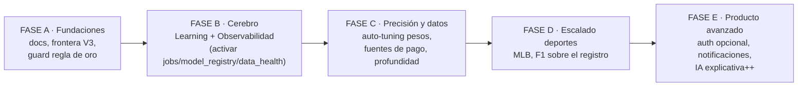
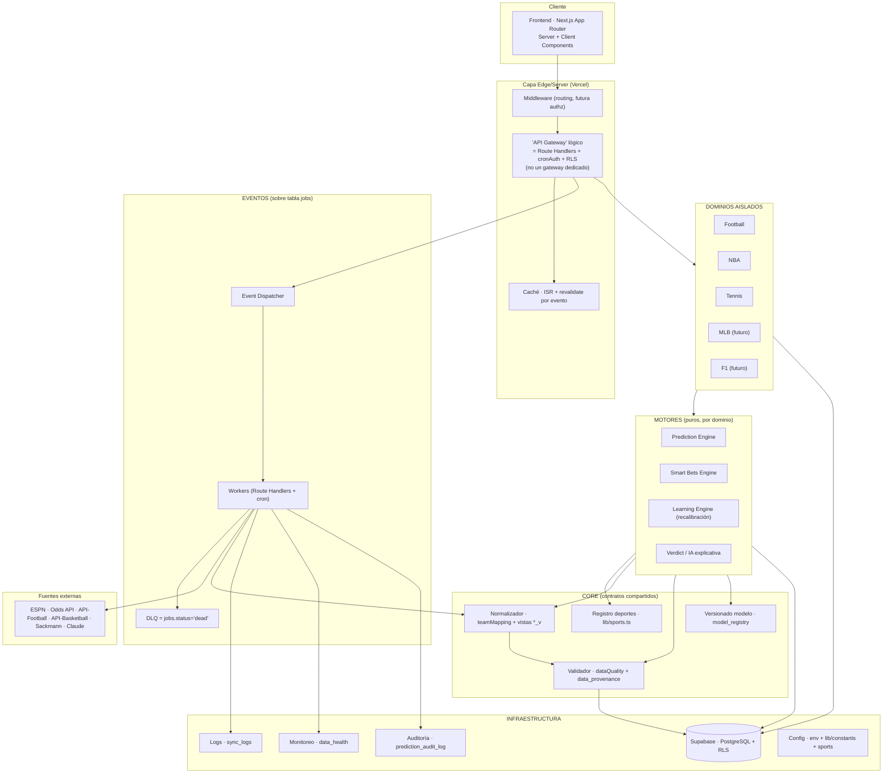
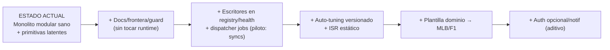

# FASE 2 · Plan Maestro de Evolución — INDU Predictor

> **Rol:** Chief Software Architect / CTO / Lead Engineer
> **Fase:** 2 — Diseño del Plan Maestro (planificación pura, sin implementar)
> **Fecha:** 2026-07-19
> **Base:** `docs/FASE1_ANALISIS_ARQUITECTURA.md` (análisis verificado del repo)
> **Rama:** `claude/indu-predictor-architecture-analysis-5qxz6y`

Este documento es el entregable de la Fase 2. **No modifica código, migraciones,
Supabase ni GitHub.** Diseña la arquitectura objetivo y el camino para llegar a
ella desde el estado real verificado en Fase 1.

---

## Tesis del plan (léase primero)

El proyecto **no necesita una nueva arquitectura**. Necesita **activar y formalizar
primitivas que ya existen** en el repositorio y que hoy están latentes o
implícitas. La evidencia de Fase 1 + verificación adicional lo demuestra:

| Componente "objetivo" pedido | Ya existe en el repo como… | Estado real |
|------------------------------|----------------------------|-------------|
| Event Bus / Workers / DLQ | tabla `jobs` (kind/payload/status/attempts/run_after/last_error) — migración 041 | **Creada, sin productor ni consumidor** |
| Sistema de logs | `sync_logs` + `lib/syncLog.ts` | **Activo** |
| Sistema de monitoreo | `data_health` | Creada, **sin escritores** |
| Sistema de auditoría | `prediction_audit_log`, `data_provenance` | Creadas, uso parcial |
| Versionado de modelo | `model_registry`, `predictions.model_version` | Creada, **sin escritores** |
| Sistema de caché | ISR + `/api/revalidate` + `docs/CACHE_STRATEGY.md` | **Activo (parcial)** |
| Learning Engine | `prediction_history` + recalibración por cron | Snapshots activos; auto-tuning **diseñado, no implementado** |
| Normalizador de datos | `lib/teamMapping.ts`, vistas `events_v`/`participants_v` | **Activo** |

**Conclusión de diseño:** la arquitectura objetivo es una **evolución conservadora**
del monolito modular Next.js + Supabase + Vercel actual, no una migración a
microservicios. Añadir Kafka, un API Gateway dedicado o un orquestador de workers
externo sería **complejidad injustificada** (viola el principio "simplicidad" del
brief) para una plataforma de lectura pública con sincronización por lotes. Donde
el brief pide un componente enterprise, este plan lo mapea a la **implementación
más simple que da la misma calidad** sobre el stack existente, y marca
explícitamente lo que se **difiere** hasta que exista una métrica que lo exija
(p. ej. millones de eventos concurrentes).

---

# 1 · Plan Maestro del Proyecto

## 1.1 Visión

Convertir la plataforma en un producto profesional de inteligencia deportiva
**multi-deporte**, con predicciones verificables, aprendizaje continuo del modelo e
IA explicativa, capaz de incorporar nuevos deportes (MLB, F1, …) **sin rediseñar la
arquitectura ni tocar la navegación raíz** — solo creciendo el registro y añadiendo
un dominio aislado.

## 1.2 Estrategia en una frase

> **Formalizar los cimientos existentes (Fase A), activar las primitivas latentes
> de aprendizaje y observabilidad (Fase B), y luego escalar deportes y profundidad
> de datos (Fases C–D) — siempre sobre la base actual, nunca reescribiendo.**

## 1.3 Pilares invariantes (no negociables durante años)

1. **Registro único multi-deporte** (`lib/sports.ts`) como punto de extensión.
2. **Aislamiento de dominios impuesto por linter** — un deporte nunca importa otro.
3. **Regla de oro multi-competición** — toda query filtra por competición.
4. **Motores puros** — lógica sin I/O, testeable sin BD.
5. **Data First** — cero datos fabricados; toda métrica con su línea base.
6. **Acceso público por defecto** — RLS lectura `anon`, escritura service-role.

Todo el plan se subordina a estos seis pilares. Cualquier decisión futura que los
contradiga debe pasar por un ADR (§8).

## 1.4 Mapa de fases (resumen)

---

# 2 · Arquitectura Objetivo

## 2.1 Vista de capas (objetivo, sobre el stack real)

## 2.2 Componentes objetivo — mapeo a implementación real

Para cada componente pedido en el brief, la implementación **más simple que da la
misma calidad** sobre este stack, y su estado.

| # | Componente | Implementación objetivo (pragmática) | Estado hoy | Justificación de la elección |
|---|------------|--------------------------------------|-----------|------------------------------|
| 1 | **Frontend** | Next.js App Router (SC+CC), React Query, Tailwind | ✅ Existe | No cambia |
| 2 | **Backend** | Route Handlers + Server Components (sin servicio aparte) | ✅ Existe | Monolito modular > microservicios a esta escala |
| 3 | **API Gateway** | *Lógico*: middleware + `cronAuth` + RLS como control de acceso unificado | ✅ Parcial | Un gateway dedicado (Kong/APIM) es overkill; **diferido** |
| 4 | **Supabase** | PostgreSQL + RLS + service-role | ✅ Existe | Es el backend; se mantiene |
| 5 | **Base de datos** | Postgres con la regla de oro + índices (88) | ✅ Existe | Particionado por deporte **solo si** una tabla supera límites reales |
| 6 | **Autenticación** | Supabase Auth **opcional**, activada solo para features de usuario (favoritos server-side, alertas) | ❌ No existe (tablas vestigiales `users`) | Se mantiene público por defecto; auth se añade cuando un feature lo exija (Fase E) |
| 7 | **Autorización** | RLS (lectura `anon`) + service-role (escritura) + `cronAuth` (sync) | ✅ Existe | Modelo probado; se documenta como contrato |
| 8 | **Normalizador de datos** | `lib/teamMapping.ts` + vistas `events_v`/`participants_v` + contratos por dominio | ✅ Parcial | Formalizar como capa CORE explícita |
| 9 | **Validador de datos** | `lib/intelligence/dataQuality.ts` + `data_provenance` + `data_quality_snapshots` | ✅ Parcial | Convertir en gate obligatorio del pipeline de ingesta |
| 10 | **Event Bus** | Dispatcher sobre tabla `jobs` (Postgres como cola) | ⚠️ Tabla creada, sin uso | Postgres-as-queue evita nueva infra; suficiente para lotes |
| 11 | **Workers** | Route Handlers `/api/jobs/run` disparados por cron + `run_after` | ⚠️ Latente | Reutiliza el patrón cron existente |
| 12 | **Prediction Engine** | `predictionEngine` / `nba/engine` / `tennis/engine2` (puros) | ✅ Existe | Núcleo sano; no se toca en Fase A |
| 13 | **Learning Engine** | Recalibración por cron + `prediction_history` + auto-tuning de pesos (F0–F5) | ⚠️ Snapshots sí; tuning no | Activar el diseño ya escrito en `WEIGHT_TUNING_DESIGN.md` |
| 14 | **Smart Bets Engine** | `lib/smartBetsEngine.ts` v3 (8 capas) + `smart_bet_picks` | ✅ Existe (fútbol) | Extender a otros deportes cuando haya cuotas |
| 15 | **Notification Engine** | `notifications` + triggers `*_notification` (hoy vestigial) | ❌ Inactivo | Reactivar solo con auth/canal real (Fase E) |
| 16 | **IA Explicativa** | Veredictos deterministas + pulido Claude (fail-open) | ✅ Existe | Extender a pre-partido y a todos los deportes |
| 17 | **Dashboard** | `app/dashboard` + `dashboard_kpis` (vista) | ✅ Existe | Añadir KPIs de salud del sistema |
| 18 | **Monitoreo** | `data_health` (poblar) + panel interno `/admin/health` | ⚠️ Tabla sin escritores | Activar escritores en cada sync |
| 19 | **Auditoría** | `prediction_audit_log` + `data_provenance` | ✅ Parcial | Hacer obligatorio el registro por predicción |
| 20 | **Caché** | ISR por tiers + `/api/revalidate` por evento | ✅ Parcial | Completar migración a cliente estático (ISR debt) |
| 21 | **Configuración** | env vars + `lib/constants` + `lib/sports` | ✅ Existe | Centralizar flags de deporte/temporada |
| 22 | **Logs** | `sync_logs` + `lib/syncLog.ts` | ✅ Activo | Extender a eventos de negocio, no solo sync |
| 23 | **Métricas** | `model_registry` (precisión/Brier) + `dashboard_kpis` | ⚠️ Registry sin escritores | Escribir métricas del backtest tras cada calibración |
| 24 | **Versionado del modelo** | `predictions.model_version` + `model_registry.version` | ⚠️ Columna sí; registry no | Registrar cada versión y sus métricas al recalibrar |

**Lectura clave de la tabla:** 12 de 24 componentes ya existen y funcionan; 8 están
**presentes pero latentes** (tablas creadas sin escritores/consumidores); solo 4
son verdaderamente nuevos (auth, notificaciones, gateway lógico formal, workers) y
todos son **diferibles** hasta que un feature concreto los exija. Esto confirma que
el trabajo es de **activación y formalización**, no de construcción desde cero.

## 2.3 Contrato de la capa CORE (compartida) vs. dominios

- **CORE / Shared** contiene solo lo **sport-neutral**: registro, normalización de
  nombres, vistas `*_v`, validación de calidad, versionado, tipos base, utilidades
  (`lib/utils`, `lib/datetime`, `lib/fetchAll`, `lib/cronAuth`).
- **Cada dominio** (Football, NBA, Tennis, MLB, F1) tiene su motor, sus métricas,
  sus componentes y —donde aplique— sus tablas exclusivas (`tennis_*`, patrón a
  replicar). **Nunca** comparte métricas específicas con otro dominio.
- **Regla de dependencia:** dominios → CORE (permitido); dominio → dominio
  (prohibido, linter); CORE → dominio (prohibido). Es exactamente el modelo actual,
  elevado a invariante explícito.

---

# 3 · Roadmap completo

```mermaid
gantt
    title Roadmap INDU Predictor (relativo, no fechas absolutas)
    dateFormat X
    axisFormat %s
    section Fase A · Fundaciones
    Docs sincronizadas            :a1, 0, 1
    Frontera V3 declarada         :a2, 0, 1
    Guard regla de oro            :a3, 1, 2
    section Fase B · Cerebro
    Activar model_registry        :b1, 2, 3
    Activar data_health           :b2, 2, 3
    Auditoría obligatoria         :b3, 3, 4
    Event dispatcher sobre jobs   :b4, 3, 5
    section Fase C · Precisión
    Auto-tuning pesos F0-F5       :c1, 5, 7
    Fuentes de pago (ligas)       :c2, 5, 6
    Cerrar ISR debt               :c3, 6, 7
    section Fase D · Escalado
    Plantilla nuevo dominio       :d1, 7, 8
    MLB / F1                      :d2, 8, 10
    section Fase E · Producto
    Auth opcional + notificaciones:e1, 10, 12
    IA explicativa pre-partido    :e2, 11, 12
```

---

# 4 · Roadmap por fases (detallado)

> Estimaciones en **semanas-persona relativas** (1 dev enfocado). No son fechas.

## FASE A — Fundaciones limpias

> **Estado: ✅ COMPLETADA** (Fase 3 + Fase 4). A1 docs sincronizadas y A2 frontera
> V3 en la Fase 3; A3 guards ejecutables (`tests/goldenRule.test.ts`,
> `tests/v3Frontier.test.ts`) en la Fase 4. Gates verdes: tsc 0 · lint 0 · 158
> tests.

- **Objetivo:** eliminar ambigüedad conceptual y blindar los invariantes antes de
  construir sobre ellos.
- **Alcance:** (A1) sincronizar `CLAUDE_CONTEXT.md`/`README` con el estado real
  (54 migraciones, 155 tests, Tenis activo); (A2) documentar la frontera entre la
  capa V3 analítica y el motor de producción; (A3) test/lint que detecte queries a
  `matches`/`teams`/`predictions` sin filtro de competición.
- **Impacto:** alto (habilita todo lo demás con seguridad).
- **Dependencias:** ninguna. Es el punto de entrada.
- **Riesgo:** muy bajo (docs + un test; no toca motores).
- **Tiempo estimado:** 1–2 semanas.
- **Prioridad:** **Crítica**.
- **Beneficio esperado:** onboarding correcto, guardrail automático del activo
  central (aislamiento), fin de la deriva documentación↔código.
- **Criterios de aceptación:**
  - Documentación maestra sin ninguna cifra falsa (verificable contra el repo).
  - Existe `docs/CAPA_ANALITICA_VS_PRODUCCION.md` con el camino autoritativo.
  - Existe una prueba que falla si una query de negocio omite `competition_id`.
  - `npm run build`, `npm test`, `npm run lint` en verde.

## FASE B — El cerebro: aprendizaje y observabilidad

- **Objetivo:** activar las primitivas latentes que convierten el modelo en un
  sistema que aprende y se auto-observa.
- **Alcance:** (B1) escribir en `model_registry` las métricas del backtest tras
  cada recalibración/calibración (fútbol, NBA, tenis); (B2) poblar `data_health`
  en cada sync (latencia, error_rate, coverage, last_ok/last_error); (B3) registro
  de auditoría obligatorio por predicción en `prediction_audit_log`; (B4)
  **Event Dispatcher sobre la tabla `jobs`**: productor (encolar), worker
  (`/api/jobs/run` por cron), reintentos con backoff (`attempts`/`run_after`) y DLQ
  (`status='dead'` tras N intentos).
- **Impacto:** alto (observabilidad + base de eventos reutilizable).
- **Dependencias:** Fase A (frontera V3 clara antes de tocar el flujo de modelo).
- **Riesgo:** medio (B4 introduce un patrón nuevo, pero sobre una tabla existente y
  con los syncs actuales como consumidores piloto).
- **Tiempo estimado:** 3–4 semanas.
- **Prioridad:** **Alta**.
- **Beneficio esperado:** métricas de modelo versionadas y visibles; fallos de sync
  detectables; pipeline de ingesta desacoplado y con reintentos/DLQ.
- **Criterios de aceptación:**
  - Cada calibración deja una fila nueva en `model_registry` con su versión.
  - `data_health` refleja el estado real de cada fuente en el panel `/admin/health`.
  - Un job que falla N veces cae a DLQ y es inspeccionable, sin tumbar el sync.
  - Cero pérdida de comportamiento en las rutas de sync existentes.

## FASE C — Precisión y profundidad de datos

- **Objetivo:** subir la precisión verificable del producto.
- **Alcance:** (C1) implementar el auto-tuning de pesos por calibración
  (`docs/WEIGHT_TUNING_DESIGN.md`, F0–F5) para el motor de fútbol; (C2) upgrade de
  plan de fuentes (API-Football de pago) para ligas 2026-27 en vivo; (C3) cerrar la
  deuda de ISR (cliente estático donde no hay cookies).
- **Impacto:** alto (credibilidad = precisión).
- **Dependencias:** Fase B (necesita `model_registry` para comparar versiones de
  pesos sin regresión).
- **Riesgo:** medio-alto (tocar pesos afecta salidas; se mitiga con backtest
  walk-forward y comparación versionada).
- **Tiempo estimado:** 2–3 semanas + coste de suscripción.
- **Prioridad:** **Alta**.
- **Beneficio esperado:** mejor Brier/accuracy medible; ligas en vivo.
- **Criterios de aceptación:**
  - El auto-tuning nunca publica pesos que empeoren el Brier en walk-forward.
  - Cada cambio de pesos queda versionado y es reversible.
  - Páginas ISR migradas sirven desde caché estático sin cookies.

## FASE D — Escalado de deportes

- **Objetivo:** incorporar MLB y F1 sin rediseño.
- **Alcance:** (D1) extraer una **plantilla de dominio** (checklist + esqueleto:
  entrada en `sports.ts`, `lib/<deporte>/`, `components/<deporte>/`,
  `app/<deporte>/`, `services/<deporte>/`, tablas exclusivas si aplica, 4 barreras
  ESLint, tests); (D2) implementar MLB y luego F1 siguiendo la plantilla.
- **Impacto:** alto (cumple la visión multi-deporte).
- **Dependencias:** Fases A–C (fundaciones + observabilidad + plantilla probada por
  el patrón Tenis).
- **Riesgo:** bajo-medio (el patrón ya está validado por 3 deportes).
- **Tiempo estimado:** 1 semana plantilla + 2–3 por deporte.
- **Prioridad:** **Media**.
- **Beneficio esperado:** crecimiento de catálogo sin tocar la raíz.
- **Criterios de aceptación:**
  - Un deporte nuevo se añade sin modificar la navegación raíz.
  - Las 4 barreras ESLint del nuevo dominio pasan y bloquean cruces.
  - F1 (que no es 1v1) se modela sin forzar el esquema `matches` de 2 equipos
    (decisión vía ADR — ver §8, ADR-007).

## FASE E — Producto avanzado

- **Objetivo:** features que requieren identidad de usuario.
- **Alcance:** (E1) Supabase Auth **opcional** (favoritos server-side, alertas);
  (E2) reactivar Notification Engine con canal real; (E3) IA explicativa
  pre-partido (no solo post).
- **Impacto:** medio (retención, no core analítico).
- **Dependencias:** Fases A–D.
- **Riesgo:** medio (auth cambia el modelo de acceso; se hace **aditivo**, sin
  romper el acceso público).
- **Tiempo estimado:** 3–4 semanas.
- **Prioridad:** **Baja** (deseable, no bloqueante).
- **Beneficio esperado:** retención y personalización.
- **Criterios de aceptación:**
  - El acceso público sigue funcionando sin login.
  - Las tablas `users`/`notifications` dejan de ser vestigiales o se eliminan por
    ADR si E se descarta.

---

# 5 · Matriz de prioridades

| Tarea | Fase | Prioridad | Justificación |
|-------|------|-----------|---------------|
| Sincronizar documentación con el repo | A | **Crítica** | Toda decisión futura parte de aquí; hoy hay cifras falsas |
| Declarar frontera capa V3 vs. producción | A | **Crítica** | Principal ambigüedad conceptual; bloquea tocar el modelo con seguridad |
| Guard automático de la regla de oro | A | **Crítica** | Blinda el activo central (aislamiento) antes de escalar |
| Activar `model_registry` (métricas versionadas) | B | **Alta** | Sin esto no se puede mejorar el modelo sin regresión |
| Activar `data_health` (observabilidad de fuentes) | B | **Alta** | Fallos de sync hoy pueden pasar inadvertidos |
| Event dispatcher sobre `jobs` + DLQ | B | **Alta** | Desacopla ingesta, da reintentos y recuperación |
| Auditoría obligatoria por predicción | B | Media | Trazabilidad; la tabla ya existe |
| Auto-tuning de pesos F0–F5 | C | **Alta** | Mayor salto de precisión del producto |
| Upgrade fuentes de pago (ligas) | C | **Alta** | Habilita ligas en vivo 2026-27 |
| Cerrar deuda ISR | C | Media | Rendimiento y coste Vercel |
| Plantilla de dominio | D | Media | Acelera y estandariza nuevos deportes |
| MLB / F1 | D | Media | Cumple visión multi-deporte |
| Decidir destino de tablas vestigiales | A/E | Media | Reduce superficie muerta; decisión, no borrado ciego |
| Auth opcional + notificaciones | E | **Baja** | Deseable, no core |
| IA explicativa pre-partido | E | **Baja** | Mejora, no bloqueante |
| Consolidar redundancia "market movement" | B/C | **Baja** | Mantenibilidad |
| Renumerar/documentar migraciones 012 duplicadas | A | **Baja** | Reproducibilidad del schema |

---

# 6 · Matriz de riesgos

| ID | Tipo | Riesgo | Prob. | Impacto | Mitigación |
|----|------|--------|-------|---------|------------|
| RT-1 | Técnico | Fuga cross-competición por query sin filtro | Media | Alto | Guard automático (Fase A3); revisión en PR |
| RT-2 | Arquitectónico | La capa V3 se convierte en un segundo motor "sombra" divergente | Media | Alto | Frontera declarada (A2); prohibir que V3 escriba en `predictions` sin pasar por el motor único |
| RT-3 | Arquitectónico | F1 (multi-competidor, sin 1v1) no encaja en `matches` de 2 equipos | Media | Medio | ADR-007: tabla de eventos propia del dominio F1, no forzar `matches` |
| RP-1 | Rendimiento | Tablas grandes (NBA ~1.314, futuras temporadas) superan el tope 1000 de PostgREST | Alta | Medio | `fetchAll.ts` ya existe; hacerlo obligatorio en queries de listado; índices por `competition_id` |
| RP-2 | Rendimiento | Auto-tuning pesos degrada precisión en producción | Media | Alto | Nunca publicar pesos que empeoren Brier walk-forward; versionar y permitir rollback |
| RP-3 | Rendimiento | ISR con cliente de cookies impide cacheo → coste/latencia | Media | Medio | Fase C3: migrar a cliente estático |
| RS-1 | Seguridad | Ausencia de CSP de scripts | Baja | Medio | Evaluar CSP con nonce sin romper Next/Supabase (ADR futuro) |
| RS-2 | Seguridad | Reactivar auth introduce vector de sesión/PII | Baja | Alto | Auth aditiva vía Supabase Auth (probado); RLS por usuario solo en tablas de usuario |
| RS-3 | Seguridad | `CRON_SECRET` único para todos los sync | Baja | Medio | Ya es timing-safe; rotar periódicamente; opcional secreto por worker |
| RE-1 | Escalabilidad | Postgres-as-queue (`jobs`) no basta ante alto volumen concurrente | Baja | Medio | Suficiente para lotes actuales; migrar a cola dedicada **solo si** la métrica lo exige (ADR-005) |
| RE-2 | Escalabilidad | Un solo proyecto Supabase para todos los deportes | Baja | Medio | La regla de oro + índices lo sostienen; particionar por deporte solo ante límite real |
| RD-1 | Dependencia APIs | Planes gratuitos (Odds 500/mes, API-Football 100/día) limitan features y frescura | Alta | Medio | Cadencias calibradas; upgrade en Fase C; `data_health` para detectar agotamiento de cuota |
| RD-2 | Dependencia APIs | Fuente cambia de formato o se cae (ESPN, Sackmann) | Media | Alto | Validador de datos como gate (Fase B); DLQ preserva el payload para reproceso |
| RD-3 | Dependencia APIs | Claude no disponible para veredictos | Baja | Bajo | Ya hay fail-open a determinista + cache permanente |

---

# 7 · Deuda técnica (clasificada)

| Deuda | Clase | Por qué |
|-------|-------|---------|
| Documentación desincronizada (50→54 migraciones, 72→155 tests, Tenis) | **Crítica** | Induce a error toda decisión y todo onboarding; barata de arreglar |
| Frontera V3 no declarada (dos nociones de "modelo") | **Crítica** | Riesgo de motor sombra divergente (RT-2) |
| Regla de oro sin verificación automática | **Crítica** | El guardrail más importante depende de disciplina humana |
| `model_registry` / `data_health` sin escritores | **Importante** | Impiden mejorar el modelo con seguridad y observar fallos |
| Auto-tuning de pesos no implementado | **Importante** | Techo de precisión del producto |
| Deuda ISR (cliente cookies donde no hace falta) | **Importante** | Rendimiento y coste |
| Tabla `jobs` creada sin productor/consumidor | **Deseable** | Base del Event Bus; activarla es valor, no urgencia |
| Tablas vestigiales `users`/`notifications` | **Deseable** | Superficie muerta; decidir destino |
| Redundancia "market movement" en 3 capas | **Deseable** | Mantenibilidad |
| Migraciones `012` duplicadas en número | **Opcional** | Reproducibilidad; ordenar/renombrar |
| Cobertura parcial de datos (jugadores Mundial, boxscores NBA, WTA) | **Opcional** | Límite de fuente, ya declarado honestamente; no es bug |

---

# 8 · ADR iniciales

> Formato: Problema · Alternativas · Decisión · Justificación · Consecuencias · Estado.
> Todos en estado **Propuesto** (esta fase no implementa).

### ADR-001 · Mantener monolito modular, no migrar a microservicios
- **Problema:** ¿La escala futura exige separar servicios por dominio?
- **Alternativas:** (a) microservicios por deporte; (b) monolito modular Next.js;
  (c) serverless por función.
- **Decisión:** (b) monolito modular con dominios aislados por linter.
- **Justificación:** el aislamiento ya se logra en código; microservicios añaden
  operación, latencia y coste sin beneficio a esta escala (lectura pública, sync
  por lotes). Cumple simplicidad/mantenibilidad.
- **Consecuencias:** un solo despliegue; la disciplina de aislamiento sigue siendo
  responsabilidad del linter, no de la red.
- **Estado:** Propuesto.

### ADR-002 · Event Bus sobre la tabla `jobs` (Postgres-as-queue), no broker externo
- **Problema:** desacoplar ingesta/procesamiento con reintentos y DLQ.
- **Alternativas:** (a) Kafka/SQS/Redis; (b) tabla `jobs` en Postgres; (c) seguir
  con crons directos sin cola.
- **Decisión:** (b), reutilizando la tabla `jobs` ya existente.
- **Justificación:** cero infraestructura nueva; transaccional con el resto de la
  BD; `attempts`/`run_after`/`last_error` ya modelan reintentos y DLQ. Suficiente
  para volúmenes de lotes.
- **Consecuencias:** los workers son Route Handlers por cron; si algún día el
  volumen concurrente lo exige, ADR-005 contempla migrar a cola dedicada.
- **Estado:** Propuesto.

### ADR-003 · Autenticación diferida y aditiva (Supabase Auth opcional)
- **Problema:** ¿introducir auth ahora?
- **Alternativas:** (a) auth global obligatoria; (b) sin auth nunca; (c) auth
  opcional solo para features de usuario.
- **Decisión:** (c), con Supabase Auth, en Fase E.
- **Justificación:** el acceso público es un pilar; auth solo aporta en features de
  identidad (favoritos server-side, alertas). Aditiva, no rompe lo público.
- **Consecuencias:** `users`/`notifications` se reactivan o se eliminan por ADR
  según se ejecute o no la Fase E.
- **Estado:** Propuesto.

### ADR-004 · Motor único de predicción; la capa V3 es solo analítica de display
- **Problema:** coexisten `predictionEngine` (autoritativo) y `lib/models`+`agents`
  (V3) sin frontera.
- **Alternativas:** (a) unificar todo en V3; (b) eliminar V3; (c) declarar V3 como
  capa de exploración/visualización que **no** escribe `predictions`.
- **Decisión:** (c).
- **Justificación:** el motor único garantiza consistencia (fuente única);
  eliminar V3 perdería paneles de transparencia útiles.
- **Consecuencias:** regla explícita: nada en V3 persiste predicciones oficiales;
  documentado en Fase A2.
- **Estado:** Propuesto.

### ADR-005 · Escalar la cola solo ante métrica que lo exija
- **Problema:** ¿cuándo dejar Postgres-as-queue?
- **Decisión:** definir umbrales (p. ej. latencia de job P95 o profundidad de cola
  sostenida) que disparen la evaluación de una cola dedicada; hasta entonces, no.
- **Justificación:** evita complejidad especulativa (YAGNI).
- **Consecuencias:** requiere que `data_health`/métricas de cola existan (Fase B).
- **Estado:** Propuesto.

### ADR-006 · Tablas exclusivas por dominio cuando el modelo diverge (patrón `tennis_*`)
- **Problema:** ¿reutilizar `matches`/`teams` o crear tablas propias por deporte?
- **Decisión:** compartir el núcleo `matches`/`teams` para deportes 1v1 con equipos;
  crear tablas exclusivas (`<deporte>_*`) cuando el modelo de datos diverge, como ya
  hizo Tenis.
- **Justificación:** equilibra reutilización y cohesión; evita columnas nullables
  específicas de un deporte contaminando la tabla compartida.
- **Consecuencias:** cada dominio decide su estrategia de persistencia; la regla de
  oro aplica a las tablas compartidas.
- **Estado:** Propuesto.

### ADR-007 · F1 no se modela como `matches` de 2 participantes
- **Problema:** F1 es multi-competidor (parrilla), no 1v1.
- **Decisión:** dominio F1 con su propio esquema de eventos/resultados, no forzar
  `matches` (home/away).
- **Justificación:** forzar 1v1 rompería cohesión y la semántica de la tabla.
- **Consecuencias:** el "detalle universal" tratará F1 como caso sport-aware propio;
  refuerza ADR-006.
- **Estado:** Propuesto.

### ADR-010 · Modularización del Prediction Engine por responsabilidades
- **Problema:** el motor de fútbol era un único archivo de ~275 líneas que
  mezclaba parámetros, factores, generación de probabilidades y orquestación;
  difícil de evolucionar y de preparar para el Learning Engine.
- **Alternativas:** (a) dejarlo como estaba; (b) split físico en submódulos con
  fachada; (c) reescritura del modelo.
- **Decisión:** (b). `lib/prediction/{config,factors,poisson}.ts` +
  `lib/predictionEngine.ts` como fachada que re-exporta el API estable. Los
  parámetros se centralizan en `ENGINE_PARAMS`.
- **Justificación:** separa "qué valores" de "cómo se calcula" (clave para el
  auto-tuning de la Fase C) sin tocar a los 13 consumidores; el motor sigue
  siendo la fuente única. Cero cambio de resultados, verificado por un test de
  caracterización con valores dorados.
- **Consecuencias:** cualquier cambio futuro de resultados exige subir versión y
  actualizar los valores dorados (rompe CI si no). Ver `docs/PREDICTION_ENGINE.md`.
- **Estado:** **Aceptado / implementado** (Fase 5).

### ADR-009 · Invariantes de arquitectura como guards ejecutables (tests)
- **Problema:** los invariantes críticos (regla de oro multi-competición,
  frontera V3) dependían de disciplina humana y revisión manual.
- **Alternativas:** (a) confiar en revisión de PR; (b) regla ESLint personalizada;
  (c) test de escaneo estático en la suite existente.
- **Decisión:** (c). `tests/goldenRule.test.ts` y `tests/v3Frontier.test.ts`
  escanean el código y fallan la CI ante una violación. Las excepciones
  conscientes se marcan con un comentario explícito `regla-oro-ok: <motivo>`.
- **Justificación:** cero dependencias nuevas (usa el runner `node:test` ya
  presente); un test es más simple y portable que una regla ESLint a medida; el
  marcador de escape documenta la intención en el propio código.
- **Consecuencias:** toda query nueva sin acotar, o cualquier intento de que V3
  escriba predicciones, rompe la CI. Estado de la Fase A: completada.
- **Estado:** **Aceptado / implementado** (Fase 4, iteraciones 1-2).

### ADR-008 · Versionado de modelo obligatorio en cada recalibración
- **Problema:** hoy `predictions.model_version` existe pero `model_registry` no se
  escribe.
- **Decisión:** cada calibración registra versión + métricas (accuracy, Brier, MAE)
  en `model_registry`; ningún cambio de pesos se publica sin comparación.
- **Justificación:** habilita mejora sin regresión y rollback (base de Fase C).
- **Consecuencias:** el Learning Engine depende de este registro.
- **Estado:** Propuesto.

---

# 9 · Plan de migración desde la arquitectura actual

**No hay migración disruptiva.** El plan es incremental y reversible por fase. La
"migración" es de **activación**, no de reemplazo.

**Principios de la migración:**
1. **Aditiva y reversible:** cada fase se puede revertir sin afectar las anteriores.
2. **Sin big-bang:** el dispatcher de eventos se estrena con los syncs actuales como
   consumidores piloto antes de generalizarse.
3. **Contrato invariante:** el motor único y la regla de oro no cambian; se rodean
   de observabilidad, no se sustituyen.
4. **Verificación por fase:** `npm run build` + `npm test` + `npm run lint` en verde
   son condición de cierre de cada fase.
5. **Datos intactos:** ninguna fase reescribe datos históricos; las tablas latentes
   se empiezan a poblar hacia adelante.

**Orden de dependencias (resumen):** A → B → C → D → E, con A como prerrequisito
absoluto de todo lo demás.

---

# 10 · Recomendaciones estratégicas

1. **Arreglar la verdad antes que el código.** La documentación desincronizada es
   la deuda más barata y la más peligrosa: contamina toda decisión. Fase A primero,
   sin excepción.
2. **No construir infraestructura que la escala aún no pide.** El mayor riesgo de
   este tipo de plan es el "architecture astronaut": Kafka, gateways y microservicios
   que nadie necesita. Este plan los **difiere explícitamente** con umbrales (ADR-005).
3. **El activo a proteger es el aislamiento multi-deporte.** Es lo que permite
   crecer años sin rediseño. Blindarlo con un guard automático (A3) vale más que
   cualquier feature.
4. **Convertir el modelo en un sistema que aprende y se observa (Fase B) antes de
   subir la precisión (Fase C).** No se puede mejorar con seguridad lo que no se
   mide ni se versiona.
5. **Resolver la identidad de marca.** La discrepancia INDU Predictor vs. Veredicto
   debe cerrarse a nivel de producto antes de comunicar externamente; es una
   decisión de negocio, no técnica, pero afecta docs, dominio y SEO.
6. **Mantener Data First como límite de producto.** Cuando la fuente no da un dato
   (boxscores NBA, cuotas secundarias), la respuesta correcta sigue siendo
   declararlo, no estimarlo. Es una ventaja competitiva de credibilidad, no una
   carencia.
7. **Cada nuevo deporte pasa por la plantilla (Fase D), nunca a mano.** Estandarizar
   el alta de dominios preserva la cohesión que hoy hace fuerte al proyecto.

---

## Coherencia con la Fase 1

Este plan es coherente con `docs/FASE1_ANALISIS_ARQUITECTURA.md` y no lo contradice:
toma sus riesgos (R1–R9), su deuda técnica (§11) y sus oportunidades (§12) y los
organiza en fases, matrices y ADRs ejecutables. Toda afirmación sobre el estado
actual está verificada contra el repositorio (tablas latentes `jobs`/`data_health`/
`model_registry` confirmadas sin escritores; `sync_logs`/ISR/`revalidate`
confirmados activos).

---

*Fin del entregable de la Fase 2. Ningún archivo de código, migración, configuración
de Supabase o GitHub fue modificado. La siguiente fase será la implementación
controlada de este plan, empezando por la Fase A.*
