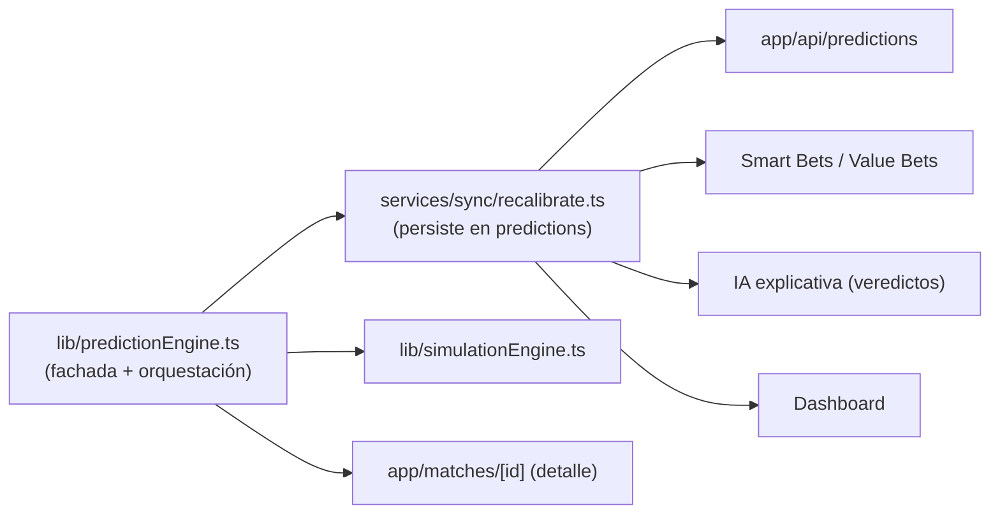
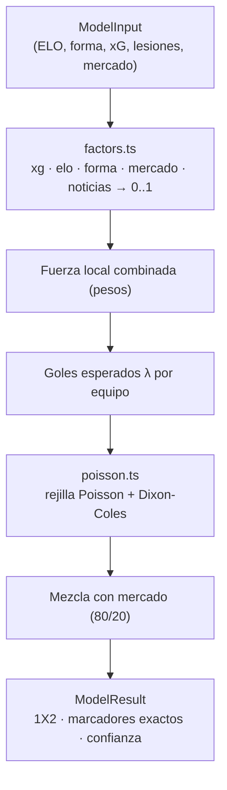

# Prediction Engine (fútbol) — Documento canónico

> **Alcance:** el motor de predicción de fútbol, única fuente de verdad de las
> probabilidades de fútbol del proyecto. NBA y Tenis tienen sus propios motores
> aislados (`lib/nba/`, `lib/tennis/`) — este documento NO los cubre.
> **Versión actual:** `1.2.0` · **Última consolidación:** 2026-07-19 (Fase 5).

---

## 1. Principio de fuente única

Ningún otro módulo calcula probabilidades de fútbol por su cuenta. Todos dependen
de este motor:

La capa analítica V3 (`lib/models`, `lib/agents`, `lib/intelligence`) puede
**consumir** helpers puros del motor para visualizaciones, pero **nunca** persiste
predicciones oficiales (ADR-004, verificado por `tests/v3Frontier.test.ts`).

---

## 2. Arquitectura modular (Fase 5)

Responsabilidades desacopladas, todas puras (sin Supabase, sin I/O):

| Módulo | Responsabilidad | Exporta |
|--------|-----------------|---------|
| `lib/prediction/config.ts` | Parámetros y versión (las "perillas" del modelo) | `ENGINE_VERSION`, `Weights`, `DEFAULT_WEIGHTS`, `ENGINE_PARAMS` |
| `lib/prediction/factors.ts` | Señales crudas → factores 0..1 + utilidades numéricas | `normalizeELO`, `formToScore`, `computeXgFactor`, `computeConfidenceLevel`, `clamp/clamp01/round4` |
| `lib/prediction/poisson.ts` | Lambdas → probabilidades (rejilla Poisson/Dixon-Coles) | `simulateMatch`, tipos `Probabilities`, `ExactScore` |
| `lib/predictionEngine.ts` | **Fachada** + orquestación de los 5 factores | `computeModelPrediction`, `computeKnockoutAdvance`, `devigMarket` + re-exporta todo el API público |

Los consumidores siguen importando desde `@/lib/predictionEngine` — la fachada
mantiene el API estable, así que el split fue **transparente** (cero cambios en
los 13 archivos que lo consumen).

---

## 3. Entradas y salidas

**Entrada (`ModelInput`):** ELO local/visitante, forma (W/D/L), xG y xGA,
tiros/goles opcionales, impacto de lesiones, probabilidades de mercado
(devigueadas) opcionales, flag `isKnockout`.

**Salida (`ModelResult`):** probabilidades 1X2 (`home`/`draw`/`away`), marcador
estimado (moda de la matriz), `confidenceScore` (0-100) y `exactScores` (top-10).

**Determinismo:** la rejilla de Poisson se resuelve **analíticamente** (no por
muestreo Montecarlo), por lo que la misma entrada produce SIEMPRE la misma salida.
Verificado por `tests/predictionEngineCharacterization.test.ts` (10 corridas
idénticas + valores dorados exactos).

---

## 4. Modelo (resumen)

Híbrido de 5 factores ponderados → distribución de goles esperados → rejilla de
Poisson con corrección Dixon-Coles (ρ = −0.11).

| Factor | Peso | Fuente |
|--------|------|--------|
| xG / capacidad ofensiva-defensiva | 40% | ataque + solidez + conversión |
| ELO | 25% | logística /400 |
| Forma reciente (10 partidos) | 15% | W=1, D=0.5, L=0 |
| Mercado (devig) | 10% | 1X2 sin margen |
| Noticias / lesiones | 10% | aptitud simétrica |

Detalles de diseño: mezcla 80/20 con el mercado a nivel de probabilidad (rescata
la señal del empate), amortiguación de goles en eliminatorias (×0.90),
`computeKnockoutAdvance` para prórroga+penales, marcador estimado = moda de la
matriz. Todo acotado (sin NaN posibles).

---

## 5. Estrategia de versionado

- **Versión de código:** `ENGINE_VERSION` en `lib/prediction/config.ts`.
- **Versión persistida:** `lib/constants.MODEL_VERSION` (lo que se guarda en
  `predictions.model_version` y `model_registry`). **Ambas deben ir en sincronía.**
- **Regla:** todo cambio que altere resultados exige, en el mismo commit:
  (1) justificación técnica en el §7 de este documento, (2) subir la versión en
  ambos sitios, (3) actualizar los valores dorados de la caracterización
  conscientemente. Un cambio de resultados sin subir versión **rompe la CI**.

---

## 6. Configuración y preparación para el Learning Engine

Todas las perillas tunables viven en `ENGINE_PARAMS` (config.ts): ρ Dixon-Coles,
maxGoals, amortiguación de eliminatoria, cotas de λ/goles/fuerza, escala de
lesiones, mezcla de mercado, coeficientes de confianza y umbrales de nivel.

Esto deja el motor **listo para el Learning Engine** (Fase C del Plan Maestro) sin
reescribir su arquitectura: el auto-tuning propondrá nuevos valores de
`ENGINE_PARAMS`/`DEFAULT_WEIGHTS` y los validará contra el backtest walk-forward.
`computeModelPrediction` ya acepta `weights` como segundo argumento, así que
probar una configuración alternativa es una llamada, no un cambio de código.
**En esta fase NO se implementa aprendizaje automático** — solo se prepara.

---

## 7. Registro de versiones del motor

| Versión | Fecha | Cambios | Motivo | Impacto |
|---------|-------|---------|--------|---------|
| 1.2.0 | (vigente) | Modelo híbrido 5 factores + Dixon-Coles + mezcla de mercado | Motor base en producción | — |
| 1.2.0 (consolidación) | 2026-07-19 | **Fase 5:** modularización en config/factors/poisson + fachada; parámetros centralizados en `ENGINE_PARAMS`; caracterización con valores dorados | Mantenibilidad y preparación para el Learning Engine | **Ninguno en resultados** — refactor verificado bit a bit (ver caracterización) |

> Nota: la consolidación de Fase 5 **no cambió la versión** porque no alteró
> ningún resultado. La próxima recalibración de pesos (Fase C) será la primera en
> subir a 1.3.0.
