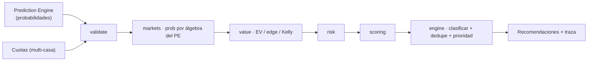

# Smart Bets Engine — Documento canónico

> **Versión:** `sbe-1.0.0` (`lib/smartBets/version.ts`) · **Fase 6** · 2026-07-19
> **Alcance:** motor de valor que CONSUME el Prediction Engine. No lo reemplaza,
> no genera probabilidades.

---

## 1. Principio de dependencia (inviolable)

```
Prediction Engine  →  Smart Bets Engine  →  Dashboard  →  IA Explicativa
```

Nunca a la inversa. El Smart Bets Engine **nunca calcula probabilidades**: las
recibe del Prediction Engine y solo hace **álgebra** sobre ellas para los
mercados derivados (doble oportunidad, empate-no-acción). Los mercados que
necesitan una distribución que el motor aún no expone (goles, ambos anotan,
córners…) quedan **registrados pero inactivos** — el motor está preparado para
activarlos sin reescritura, en cuanto el Prediction Engine exponga esa
distribución.

---

## 2. Arquitectura modular (`lib/smartBets/`)

Cada módulo tiene una única responsabilidad:

| Módulo | Responsabilidad |
|--------|-----------------|
| `version.ts` | Versión del motor (`SMART_BETS_ENGINE_VERSION`), independiente del PE |
| `types.ts` | Contratos: `ModelProbabilities` (entrada del PE), `OddsQuote`, `MatchContext`, `TraceRecord`, `SmartBetRecommendation` |
| `validate.ts` | Ingesta / validación (detecta inconsistencias; entrada incoherente → sin recomendaciones) |
| `markets.ts` | **Registro de mercados** extensible y multi-deporte; deriva la prob. por álgebra del PE |
| `value.ts` | Comparación de cuotas (multi-casa: `bestQuote`) + valor esperado / edge / grado / Kelly |
| `risk.ts` | Análisis de riesgo 0-100 (pesos explícitos: cuota 45, confianza 35, edge 20) |
| `scoring.ts` | Score compuesto 0-100 explicable y reproducible (EV 40, edge 25, confianza 20, riesgo 15) |
| `engine.ts` | Orquestador: pipeline completo → recomendaciones con trazabilidad |
| `index.ts` | API público (barrel) |



---

## 3. Reutilización (sin duplicar lógica)

`value.ts` reutiliza `gradeEV` y `kellyFraction` de `lib/valueBets.ts` (matemática
de apuestas neutra, fuente única). No se duplica ni se reescribe el motor
form-based existente (`lib/smartBetsEngine.ts`) ni el `valueBets` de producción —
el nuevo motor es **aditivo** y no altera el flujo de `value_bets`/`smart_bet_picks`
en vivo (cero regresión).

---

## 4. Sistema de scoring (explicable y reproducible)

Score 0-100 = 40·EVₙ + 25·edgeₙ + 20·confianzaₙ + 15·(1−riesgoₙ), con
normalizaciones de tope documentadas (`SCORE_CAPS`: EV 20%, edge 12%). Cada
recomendación lleva su `scoreBreakdown` — se puede auditar de dónde salió cada
punto. Sin valores arbitrarios; determinista.

---

## 5. Trazabilidad (`TraceRecord`)

Cada recomendación registra: fecha, partido, mercado, **probabilidad usada**,
**cuota usada** (y casa), valor esperado, nivel de riesgo, **versión del
Prediction Engine** y **versión del Smart Bets Engine**, y el motivo. Es el
registro de auditoría exigido por la fase.

---

## 6. Preparación para el futuro (sin tocar la arquitectura)

- **Nuevos mercados:** añadir una entrada al registro (`markets.ts`) con su
  `probabilityFrom` cuando el PE exponga la distribución. El pipeline no cambia.
- **Nuevos deportes:** el registro lleva `sport`; NBA y tenis ya tienen sus
  moneylines registrados. El orquestador es sport-agnóstico y aísla por deporte.
- **Nuevas casas:** `OddsQuote` lleva `bookmaker`; `bestQuote` elige la mejor.
  Nunca se depende de un único proveedor.
- **Nuevos algoritmos:** riesgo y scoring son módulos aislados; se pueden
  evolucionar (con bump de versión) sin tocar ingesta/mercados/valor.

---

## 7. API pública (referencia)

```ts
import { generateSmartBets, type GenerateInput } from '@/lib/smartBets'

const recs = generateSmartBets({
  match:  { matchId, competitionId, sport, homeName, awayName, kickoff },
  model:  { home, draw, away, confidenceScore, modelVersion }, // del Prediction Engine
  quotes: [{ marketId, bookmaker, oddsValue }, ...],           // multi-casa
  options?: { minScore?, maxPerMatch?, now? },
}) // → SmartBetRecommendation[] (ordenadas por score, sin duplicados de familia)
```

Helpers también exportados: `compareModelVsOdds`, `bestQuote`, `assessRisk`,
`scoreRecommendation`, `validateInputs`, `MARKET_REGISTRY`, `marketsForSport`,
`getMarket`.

---

## 8. Estado y próximos pasos

- **Implementado (Fase 6):** motor de valor puro, modular, determinista, con
  registro de mercados, scoring, riesgo y trazabilidad. Mercados activos: familia
  1X2 (fútbol) por álgebra del PE + moneylines NBA/tenis. 10 pruebas.
- **Pendiente (requiere entorno conectado + validación):** (a) cablear el motor
  a un endpoint/persistencia que lea `predictions` + `odds` reales y escriba las
  recomendaciones; (b) activar mercados de goles/BTTS cuando el PE exponga la
  rejilla; (c) panel en el Dashboard que consuma estas recomendaciones. Ninguno
  se hizo en esta fase para no introducir regresiones sin poder validarlas.
- **No se tocó:** el Prediction Engine, el Dashboard, ni la IA. El motor
  form-based existente (`lib/smartBetsEngine.ts`) y `valueBets` de producción
  siguen intactos.
